**Sections:**  
[Select Results](#select)  
[Comparison](#comparison)  
[Back to main](./)
 

## Select Results

The following images are some select results from experimenting. Besides the sunflower image which is from [here](https://wallpapersontheweb.net/1401-sunflower-earth/), all of the input photos are my own.

___

### "Mirror Lake", Franklin Carmichael, 1929

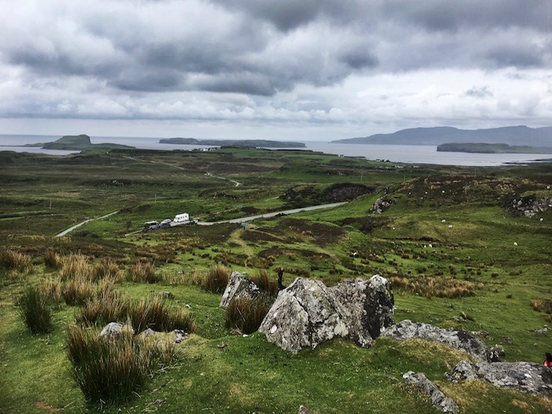
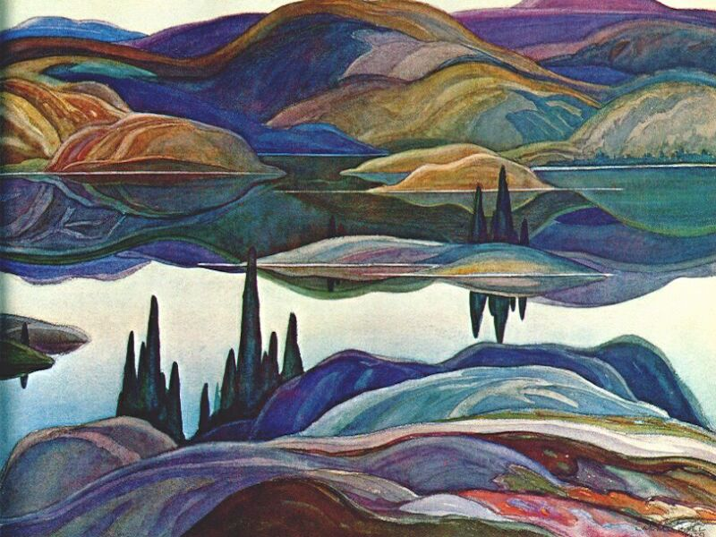

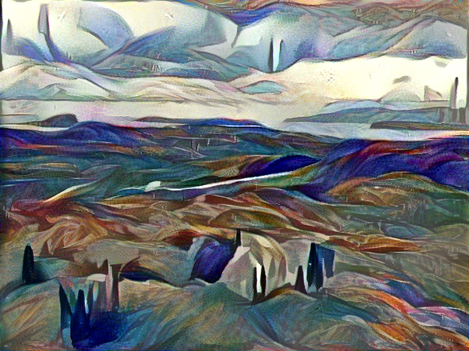

___

### "Landscape With A Canal", Paul C&eacute;zanne, 1879

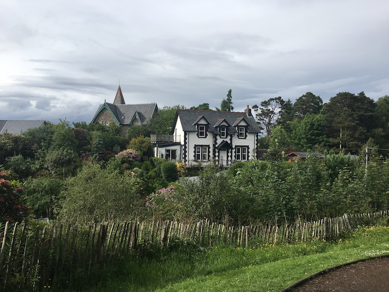
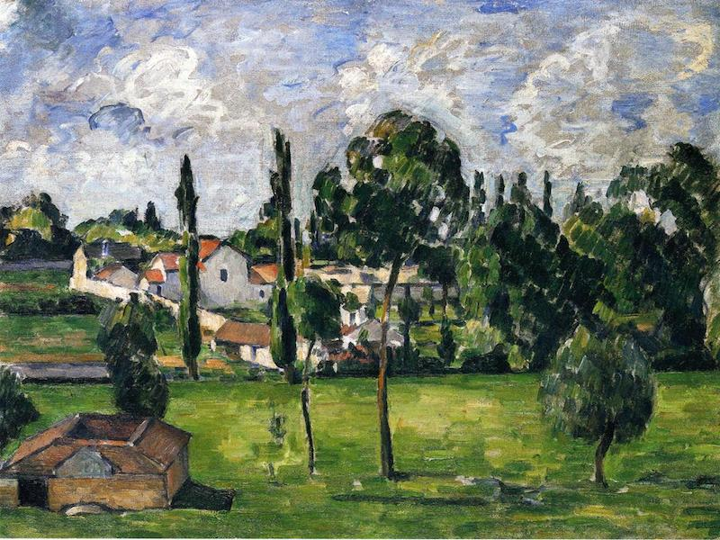

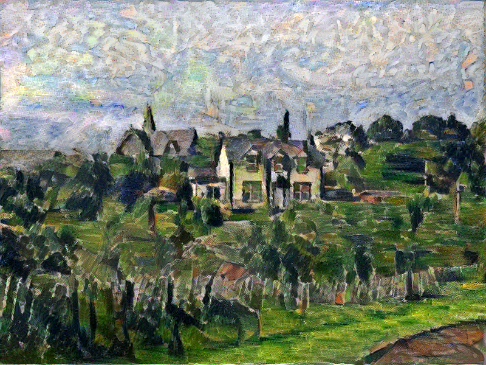

____

### "Woman With A Hat", Henri Matisse, 1905

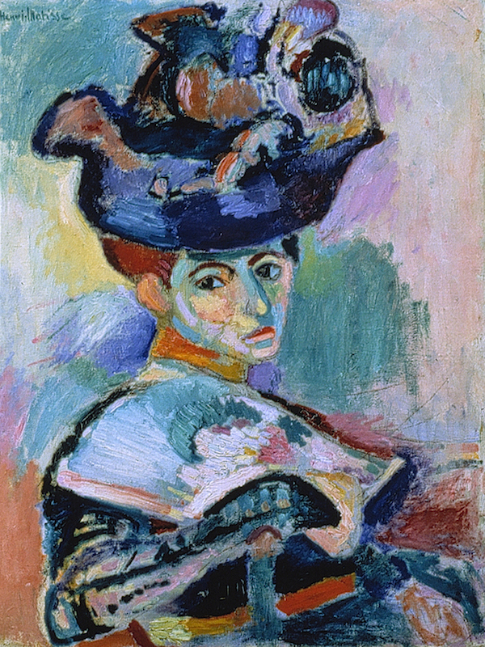

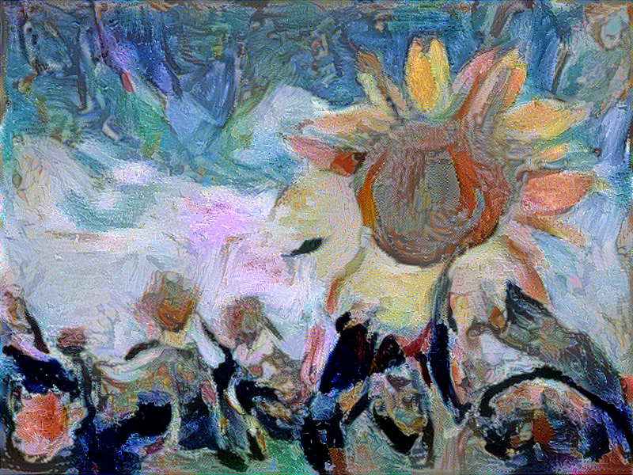

___

### "Lake Wabagishik, Franklin Carmichael, 1928

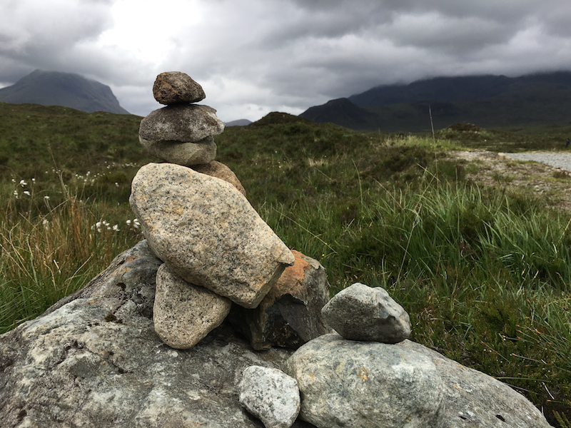
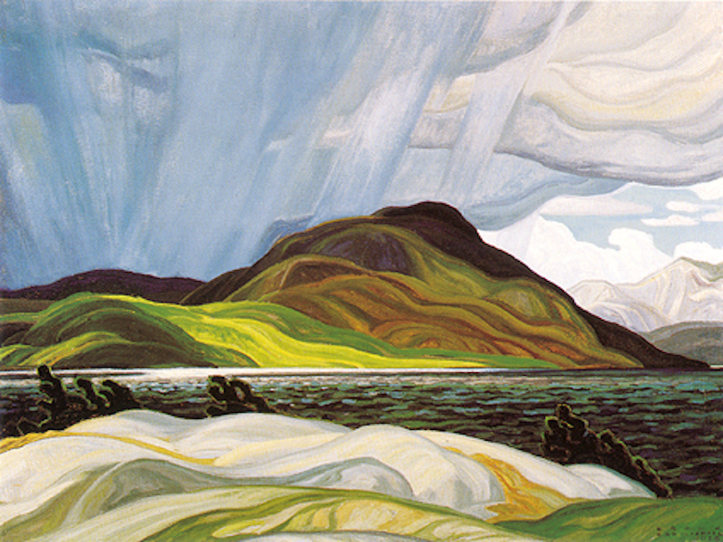

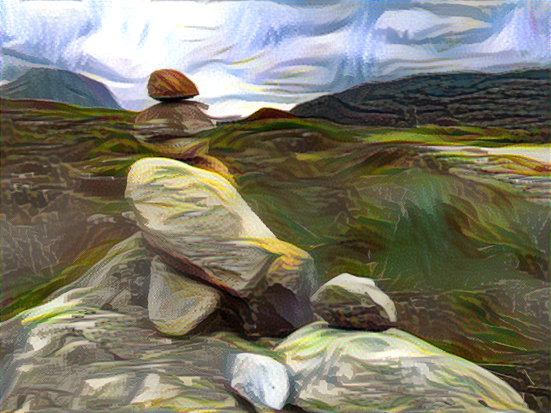

___

### "In The Northland", Tom Thomson, 1915

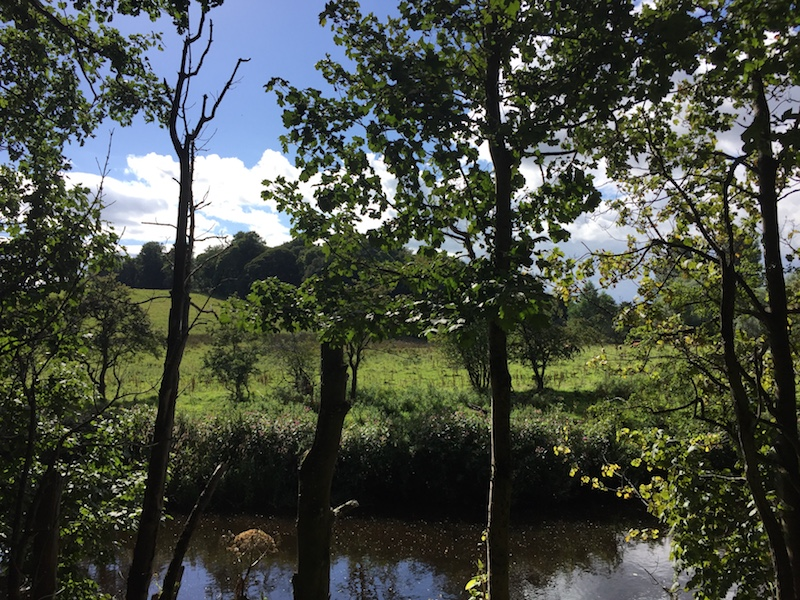
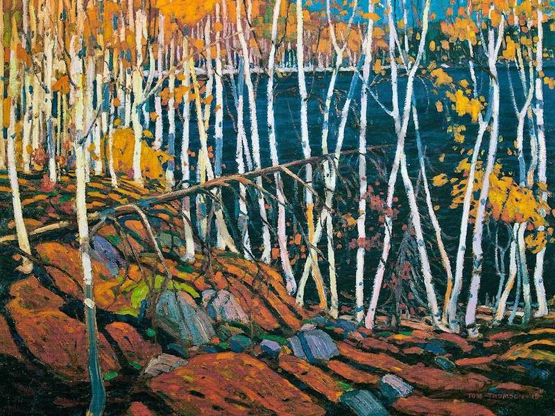

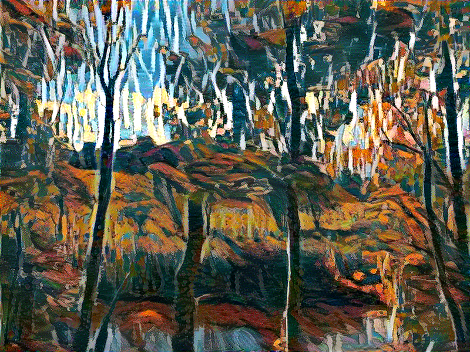

___

### "The Starry Night", Vincent Van Gogh, 1889

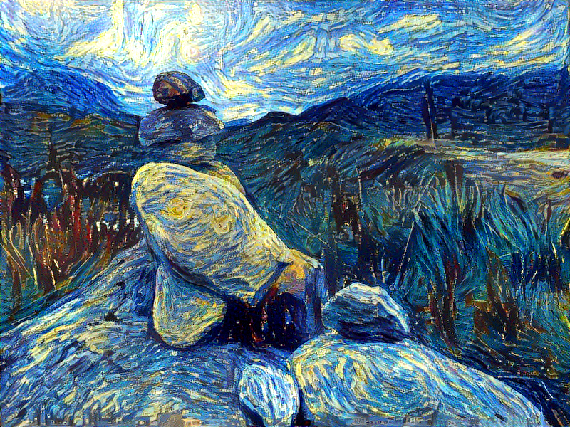

___

## Comparison

Below is a comparison of results that all use the default settings in the source code.

### Notes

The content image was used as a base instead of a white noise image. The alpha/beta ratio was then inverted, placing more emphasis on style.

For content loss conv2_2 was used instead/along with conv4_2. As outlined [here](https://www.cv-foundation.org/openaccess/content_cvpr_2016/papers/Gatys_Image_Style_Transfer_CVPR_2016_paper.pdf), using conv2_2 can result in preserving more of the finer details of the original image.

Features of higher layers get increasingly complex and abstract, instead of the default 0.2 weight for each style layer, the weights were set higher on lower layers to emphasize basic structures, and decreased for higher layers.

This gave me a noticeable improvement for styles defined by "coarse" textures such as Van Gogh's aggressive brush strokes or Picasso's cubist paintings.

Best results were easiest to obtain when using style and content images whose general structure is similar.

___

#### Common content image from [here](https://wallpapersontheweb.net/1401-sunflower-earth/)

___
#### "The Starry Night", Vincent Van Gogh, 1889

___
### "Houses On The Hill", Pablo Picasso, 1902

___
### "Woman With A Hat", Henri Matisse, 1905

